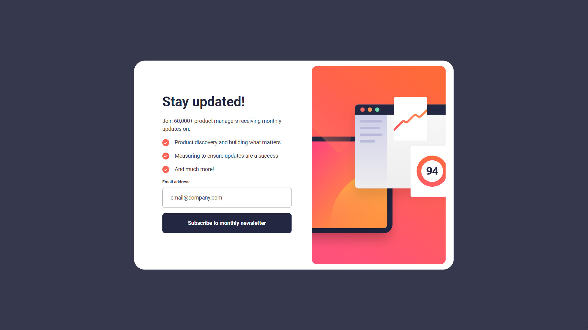

# Frontend Mentor - Newsletter sign-up form with success message solution

This is a solution to the [Newsletter sign-up form with success message challenge on Frontend Mentor](https://www.frontendmentor.io/challenges/newsletter-signup-form-with-success-message-3FC1AZbNrv). Frontend Mentor challenges help you improve your coding skills by building realistic projects. 

## Table of contents

- [Overview](#overview)
  - [The challenge](#the-challenge)
  - [Screenshot](#screenshot)
  - [Links](#links)
- [My process](#my-process)
  - [Built with](#built-with)
  - [What I learned](#what-i-learned)
  - [Continued development](#continued-development)
  - [Useful resources](#useful-resources)
- [Author](#author)
- [Acknowledgments](#acknowledgments)

## Overview

### The challenge

Users should be able to:

- Add their email and submit the form
- See a success message with their email after successfully submitting the form
- See form validation messages if:
  - The field is left empty
  - The email address is not formatted correctly
- View the optimal layout for the interface depending on their device's screen size
- See hover and focus states for all interactive elements on the page

### Screenshot



### Links

- Solution URL: [Add solution URL here](https://github.com/victor247k/Newsletter-sign-up)
- Live Site URL: [Add live site URL here](https://victor247k.github.io/Newsletter-sign-up/)

## My process

### Built with

- Semantic HTML5 markup
- CSS custom properties
- Flexbox
- CSS Grid
- Mobile-first workflow
- [React](https://reactjs.org/) - JS library // tried and got pretty far, but then I switched back to normal html and js
- JS
- Writing this README file
- Making the repository 

### What I learned

I have learnt how to code a pretty good form that actually gets you to another page, and how to style it. How to display on a another page the result of the form using js.

```html
<form action="results.html" method="get">
  <label for="email">Email address</label>
  <input name="name" type="email" required placeholder="email@company.com" id="email">
  <button type="submit" id="submit">Subscribe to monthly  newsletter<button>
</form>
```
```css
ul {
    list-style: none;
}
```
```js
const span = document.getElementById('emailText');
new URLSearchParams(window.location.search).forEach((value, name) => {
    span.textContent = `${value}`
})
```

### Continued development

I need to get better at styling, how to be more efficient and make stuff look good, I still have a lot of html to learn, and a lot of javascript.

### Useful resources

- [Example resource 1](https://youtu.be/fNcJuPIZ2WE) - This helped me further undestand forms. I really like how this guy explains stuff.

## Author

- Bio - [Victor](https://dose.lol/victor)
- Frontend Mentor - [@victor247k](https://www.frontendmentor.io/profile/victor247k)
- Instagram - [@victorspinei247](https://www.instagram.com/victorspinei247/)

## Acknowledgments

Thanks to frontend mentor for making this challange and forcing me to improve.